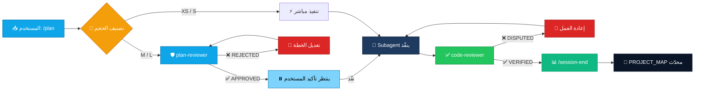
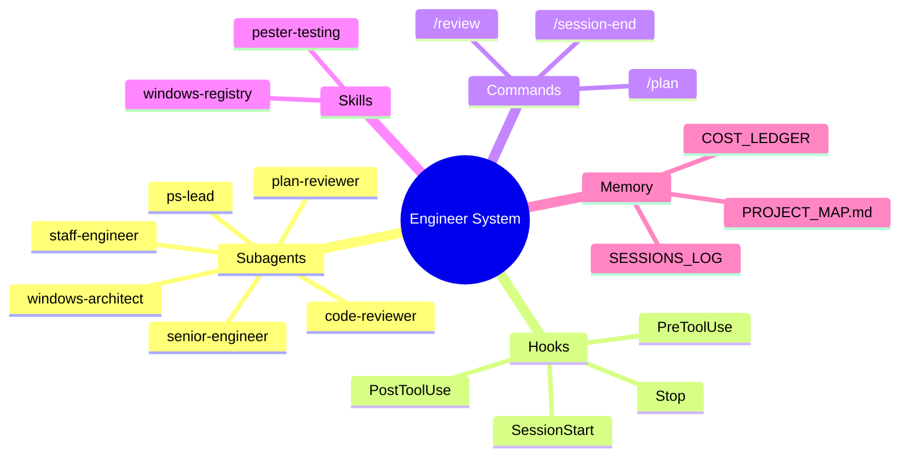
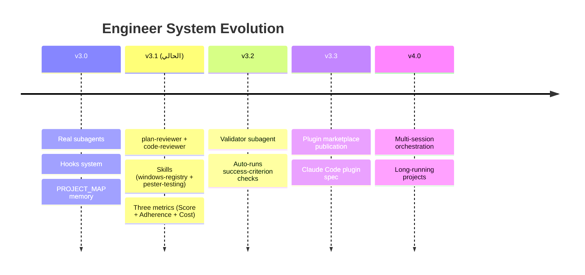

<div align="center">


[](#)
[](#-subagents--الوكلاء-المتخصصون)
[](#-hooks--الـ-hooks-البرمجية)
[](#)
[](https://github.com/F2lcon01)


</div>

---

## 📋 الفهرس

| # | القسم | الوصف |
|:-:|-------|-------|
| 1 | [🎯 لماذا هذا النظام](#-لماذا-هذا-النظام--why-this-exists) | الفجوة في قوالب Claude Code الحالية |
| 2 | [🏆 المزايا الأساسية](#-المزايا-الأساسية--core-features) | الـ subagents والـ hooks والـ skills |
| 3 | [🤖 الوكلاء المتخصصون](#-الوكلاء-المتخصصون--subagents) | جدول الـ 6 وكلاء وأدوارهم |
| 4 | [⚙️ الـ Hooks البرمجية](#%EF%B8%8F-الـ-hooks-البرمجية--hooks) | 4 أحداث تفرض القواعد آلياً |
| 5 | [🔄 Workflow بمرحلتين](#-workflow-بمرحلتين--two-gate-workflow) | مخطط `plan-reviewer` + `code-reviewer` |
| 6 | [🏗️ المعمارية](#%EF%B8%8F-المعمارية--architecture) | بنية النظام كاملةً |
| 7 | [📦 التثبيت](#-التثبيت--installation) | Windows / Linux / macOS |
| 8 | [▶️ الاستخدام](#%EF%B8%8F-الاستخدام--usage) | الجلسة الأولى + المقاييس الثلاثة |
| 9 | [📊 المقارنة](#-المقارنة-مع-القوالب-الأخرى--comparison) | مع `wshobson/agents`, `VoltAgent`, `CCDK` |
| 10 | [⚠️ الحدود والقيود](#%EF%B8%8F-الحدود-والقيود--limitations) | ما لا يقدر النظام عليه |
| 11 | [🗺️ خارطة الطريق](#%EF%B8%8F-خارطة-الطريق--roadmap) | v3.2 → v4.0 |
| 12 | [📈 الإحصائيات](#-إحصائيات-المشروع--project-stats) | عدّ الملفات والأسطر |

---

## 🎯 لماذا هذا النظام — Why This Exists

> معظم قوالب Claude Code إما **كتالوج بـ 100+ وكيل لن تستخدم منهم 5%**، أو **بروم�� ضخم في `CLAUDE.md` ينساه الموديل في منتصف الجلسة**. هذا النظام مختلف.

| الجانب | الطريقة التقليدية | Engineer System |
|--------|-------------------|:---------------:|
| **عدد الوكلاء** | 🔴 100+ يفقد التركيز | 🟢 **6 فقط** — كل واحد له دور قاطع |
| **الـ Memory** | 🔴 يضيع بين الجلسات | 🟢 **PROJECT_MAP.md** يُحقَن آلياً |
| **مراجعة الخطة** | 🔴 لا توجد | 🟢 **plan-reviewer قبل التنفيذ** |
| **مراجعة الكود** | 🔴 مدمجة مع المنفّذ | 🟢 **code-reviewer مستقل** |
| **منصة Windows** | 🔴 درجة ثانية | 🟢 **First-class** — Registry + GPO + PS |
| **تتبع التكلفة** | 🔴 لا توجد آلية | 🟢 **`$/point` ledger** |
| **القواعد** | 🔴 برومبت يطلب | 🟢 **Hooks تفرض برمجياً** |

> [!IMPORTANT]
> **المميز الأهم:** Windows + PowerShell من الدرجة الأولى. أغلب القوالب تفترض Unix؛ هذا يشحن `windows-architect` و `ps-lead` يفهمان Registry وGroup Policy وPester ومعمارية الـ modules.

---

## 🏆 المزايا الأساسية — Core Features

<div align="center">

### 1️⃣ Real Subagents — وكلاء حقيقيون بسياقات منفصلة

</div>

> كل وكيل ملف `.md` بـ YAML frontmatter، يعمل في **context window منفصل**، ويختاره Claude Code تلقائياً حسب وصف المهمة.

```
  ┌──────────────────────────────────────────────────────────┐
  │  🥇  staff-engineer     →  بحث + تحليل + مقارنة         │
  │  🥈  senior-engineer    →  تنفيذ كود إنتاجي عام         │
  │  🥉  windows-architect  →  Registry + GPO + Deployment   │
  │  🔧  ps-lead            →  PowerShell modules + Pester   │
  │  🛡️  plan-reviewer      →  بوابة قبل التنفيذ            │
  │  ✅  code-reviewer      →  بوابة بعد التنفيذ            │
  └──────────────────────────────────────────────────────────┘
```

> [!TIP]
> الفرق عن قوالب الـ "100+ agents": هنا كل وكيل **يُستدعى فعلاً** في مشروع حقيقي، لا مجرد ملف مزخرف.

<div align="center">

### 2️⃣ Hooks That Enforce — لا تطلب

</div>

> الـ hooks تشتغل **خارج LLM** — لا يمكن للموديل تجاوزها بـ "نسيت" أو "حاولت تعديل القاعدة".

```
  📡  PreToolUse (Bash)    ──→  يحظر rm -rf / و mkfs و git push -f
  📊  PostToolUse (Edit)   ──→  يسجل كل تعديل في .session-edits.log
  🚀  SessionStart         ──→  يحقن PROJECT_MAP + git context تلقائياً
  ⏱️  Stop                 ──→  يذكّر بـ /session-end إذا نسيت
```

> [!WARNING]
> الـ hooks تتطلب **bash** على Windows (Git for Windows أو WSL). المثبّت يفحص توفّر bash ويحذّر إن لم يجده.

<div align="center">

### 3️⃣ Progressive-Disclosure Skills — معرفة عند الحاجة

</div>

> Skills تُحمَّل **فقط عند الحاجة** — توفير توكن حقيقي مقابل وضع كل المعرفة في وكيل واحد ضخم.

```
  📡  Skills Library
      ├── windows-registry  →  Patterns آمنة لتعديل Registry مع rollback
      └── pester-testing    →  Pester 5+ patterns للاختبارات الإنتاجية
```

---

## 🤖 الوكلاء المتخصصون — Subagents

<details open>
<summary><h3>🖥️ الجدول الكامل — 6 وكلاء</h3></summary>

| # | Subagent | Role | Model | Trigger |
|:-:|----------|------|:-----:|---------|
| 1 |  | بحث، تحليل، مقارنة | `Sonnet` | research, compare, investigate |
| 2 |  | تنفيذ، bug fix، refactor | `Sonnet` | implement, write code, fix bug |
| 3 |  | Registry، GPO، Deployment | `Opus` | registry, GPO, telemetry, harden |
| 4 |  | PowerShell modules، Pester | `Sonnet` | PowerShell, .psm1, Pester |
| 5 |  | يراجع الخطط قبل التنفيذ | `Opus` | review plan, validate approach |
| 6 |  | يتحقق من العقود بعد التنفيذ | `Sonnet` | review code, verify contract |

> [!NOTE]
> الـ `plan-reviewer` و `windows-architect` على **Opus** لأنهما يتخذان قرارات معمارية وأمنية؛ البقية على **Sonnet** للتوازن بين الجودة والتكلفة.

</details>

---

## ⚙️ الـ Hooks البرمجية — Hooks

| Hook | Event | الغرض | الكود |
|------|-------|-------|:-----:|
| `session-start.sh` | `SessionStart` | حقن `PROJECT_MAP.md` + git context | 35 سطر |
| `pre-bash.sh` | `PreToolUse:Bash` | حظر الأوامر المدمرة | 42 سطر |
| `post-edit.sh` | `PostToolUse:Edit\|Write` | تسجيل كل ملف معدّل | 20 سطر |
| `stop-reminder.sh` | `Stop` | تذكير بـ `/session-end` | 30 سطر |

> [!CAUTION]
> الأنماط المحظورة في `pre-bash.sh` تشمل: `rm -rf /`, `mkfs.*`, `dd if=*of=/dev/`, `chmod -R 777 /`, `DROP DATABASE`, `git push -f`, `git push --force-with-lease`, fork bombs. **لا يمكن تجاوزها داخل Claude Code** — يجب تنفيذها يدوياً خارج الجلسة.

---

## 🔄 Workflow بمرحلتين — Two-Gate Workflow



> [!TIP]
> **القاعدة الذهبية:** لا تتجاوز بوابة. المهام XS فقط هي التي تُنفَّذ مباشرة بدون مراجعة.

### مثال جلسة واقعية

```text
المستخدم: /plan add Cortana disable feature

Principal Engineer:
  → يحلل، يصنّف M، يقترح windows-architect
  → يستدعي plan-reviewer تلقائياً
     plan-reviewer: "rollback plan missing for HKLM:\...\Cortana"
  → Principal: أصلح الخطة، أضف rollback
  → plan-reviewer: ✅ APPROVED
  → ⏸️ ينتظر تأكيد المستخدم

المستخدم: نفّذ
  → windows-architect ينفّذ
  → code-reviewer يتحقق: pre/post conditions، Pester
  → code-reviewer: ✅ VERIFIED

Principal: يقبل → /session-end
  📊 Score: 47/50  |  Adherence: 9/10  |  Cost: $0.058  |  $/point: $0.0012
```

---

## 🏗️ المعمارية — Architecture



### بنية الملفات بعد التثبيت

```
  your-project/
  ├── 📜 CLAUDE.md                       ← Orchestration layer
  ├── 📁 memory/
  │   └── 🧠 PROJECT_MAP.md              ← ذاكرة دائمة (auto-injected)
  └── 📁 .claude/
      ├── ⚙️  settings.json              ← Hooks configuration
      ├── 📁 agents/                     ← 6 subagents (.md + YAML)
      ├── 📁 commands/                   ← 3 slash commands
      ├── 📁 hooks/                      ← 4 shell scripts
      └── 📁 skills/                     ← 2 progressive skills
```

---

## 📦 التثبيت — Installation

### ▶️ Windows (PowerShell)

```powershell
# 1. استنسخ المستودع لمكانه الافتراضي
git clone https://github.com/F2lcon01/Engineer-System.git "$env:USERPROFILE\Desktop\Engineer System"
cd "$env:USERPROFILE\Desktop\Engineer System"

# 2. سجّل اختصار install-eng في الـ profile (مرة واحدة)
$func = 'function install-eng { & "$env:USERPROFILE\Desktop\Engineer System\installer\Install-EngineerSystem.ps1" @args }'
Add-Content -Path $PROFILE -Value $func -Force
. $PROFILE

# 3. ثبّت في أي مشروع
cd C:\path\to\your-project
install-eng
```

### ▶️ Linux / macOS / WSL (Bash)

```bash
git clone https://github.com/F2lcon01/Engineer-System.git ~/.engineer-system
cd ~/your-project
bash ~/.engineer-system/installer/install.sh
```

### ▶️ أوضاع المثبّت

| الوضع | الأمر | الغرض |
|-------|------|-------|
| 🟢 **Install** | `install-eng` | تثبيت جديد (يفشل إذا وُجد) |
| 🔄 **Upgrade** | `install-eng -Mode Upgrade` | تحديث الوكلاء مع حماية بياناتك |
| 🔍 **DryRun** | `install-eng -Mode DryRun` | معاينة بدون كتابة |
| ⚠️ **Force** | `install-eng -Force` | استبدال بالقوة (خطر) |

### ✅ التحقق من التثبيت

```powershell
Test-Path .\CLAUDE.md
Test-Path .\.claude\settings.json
Test-Path .\memory\PROJECT_MAP.md
Get-ChildItem .\.claude\agents
```

> [!NOTE]
> ستظهر `CLAUDE.md` و `.claude/settings.json` و `memory/PROJECT_MAP.md` و**ست ملفات وكلاء** داخل `.claude/agents`.

---

## ▶️ الاستخدام — Usage

### الجلسة الأولى

```powershell
cd C:\path\to\your-project
install-eng                    # مرة واحدة
claude                         # افتح Claude Code
```

داخل Claude Code اكتب:

```
/plan Add a PowerShell function to check Windows Update service status
```

> النظام يحلّل، يقترح `ps-lead`، يضع معيار نجاح قابلاً للاختبار، ويستدعي `plan-reviewer` للمهام M/L تلقائياً. أكّد للمتابعة.

### المقاييس الثلاثة في `/session-end`

```
  ┌──────────────────────┬──────────────────────────────────────┐
  │  📊 Score /50        │  جودة المخرج الكلية                  │
  │  🎯 Plan-Adherence   │  /10 — مدى الالتزام بالخطة الأصلية   │
  │  💰 Cost-of-Pass     │  التكلفة الفعلية بالتوكن/الدولار     │
  └──────────────────────┴──────────────────────────────────────┘
```

### مثال COST_LEDGER بعد عدة جلسات

```diff
- Session 12 | Score 35 | Adherence 5  | $0.42 | $/pt $0.0120  ← غالي، انحراف
+ Session 13 | Score 48 | Adherence 10 | $0.06 | $/pt $0.0012  ← مثالي
  Session 14 | Score 42 | Adherence 9  | $0.08 | $/pt $0.0019  ← جيد
```

> [!IMPORTANT]
> بعد 10–15 جلسة، الـ `[COST_LEDGER]` يكشف **نمطك الشخصي**: متى تنحرف، ومتى تنجح، وأي workflows تستحق فعلاً.

---

## 📊 المقارنة مع القوالب الأخرى — Comparison

| الميزة | **Engineer System** | wshobson/agents | VoltAgent | peterkrueck/CCDK |
|--------|:-------------------:|:---------------:|:---------:|:----------------:|
| Real subagents (YAML) | ✅ **6 focused** | ✅ 100+ | ✅ | ✅ |
| Programmatic hooks | ✅ **4 events** | 🟡 جزئي | ❌ | 🟡 جزئي |
| Persistent memory | ✅ **Auto-injected** | ❌ | ❌ | 🟡 جزئي |
| Two-gate review | ✅ **Plan + Code** | ❌ | ❌ | ❌ |
| Windows/PowerShell | ✅ **First-class** | ❌ | ❌ | ❌ |
| Cost tracking | ✅ **`$/point`** | ❌ | ❌ | ❌ |
| Dual installer | ✅ **PS + Bash** | ❌ | ❌ | Bash فقط |
| File count | 📦 **26** | 500+ | 100+ | 50+ |

> [!TIP]
> النظام **مقصود أن يكون أصغر** من المنافسين. ليس كتالوجاً — بل إطار عمل ذو رأي واضح.

---

## ⚠️ الحدود والقيود — Limitations

> [!WARNING]
> الصدق المعتاد حول ما لا يقدر النظام عليه:

| القيد | الشرح |
|-------|-------|
| 🟠 **ليس للجلسات القصيرة** | تكلفة بدء الـ subagents ~3-4K توكن. مفيد لجلسات +2 ساعة، مهدر لـ Q&A سريع. |
| 🟠 **plan-reviewer مفرط الحذر** | ~10% معدل رفض كاذب على خطط بسيطة. تجاوز عند المبرر. |
| 🟠 **تتبع التكلفة تقريبي** | Claude Code لا يكشف عدد التوكن بدقة لحظية. استخدم كمؤشر اتجاه. |
| 🟠 **Claude Code فقط** | الـ hooks والـ subagents لا توجد في `claude.ai`. النظام بلا قيمة هناك. |
| 🟠 **Plan-adherence ذاتي** | تقيّمه أنت. كن صادقاً ولا تعطِ نفسك 10/10 إذا انحرفت. |

---

## 🗺️ خارطة الطريق — Roadmap



---

## 📈 إحصائيات المشروع — Project Stats

<div align="center">

| Category | Count | Coverage |
|----------|:-----:|:--------:|
| 🤖 Subagents | 6 |  |
| ⚙️ Hooks | 4 |  |
| 💬 Slash Commands | 3 |  |
| 🧠 Skills | 2 |  |
| 📜 Installers | 2 |  |
| 📄 Total Files | **26** |  |
| 📏 Total Lines | **~1900** |  |

</div>

---

## 🔧 المتطلبات — Requirements

```
  📡 Required Stack
      ├── Claude Code         →  v2.1.0 أو أحدث
      ├── Node.js             →  v18+ (لـ Claude Code CLI)
      ├── PowerShell          →  5.1+ (Windows)
      ├── Bash                →  4+ (Linux/macOS/Git Bash)
      └── Git for Windows     →  مطلوب للـ hooks على Windows
```

---

## 🤝 المساهمة — Contributing

Pull requests مرحَّب بها. قبل فتح PR:

1. ✅ اختبر تغييرك في مشروع حقيقي لجلسة كاملة على الأقل
2. ✅ حدّث `README.md` إذا غيّرت سلوكاً يراه المستخدم
3. ✅ تأكد أن الـ hooks تعمل على Git Bash على Windows
4. ✅ أضف معيار نجاح قابلاً للاختبار في الـ PR description

---

## 📜 الترخيص — License


MIT License — راجع ملف [LICENSE](LICENSE).

---

<div align="center">

**Engineer System v3.1** — بقلم Falcon (fox01vip@gmail.com)

[](https://github.com/F2lcon01)
[](https://github.com/F2lcon01/Engineer-System)
[](https://github.com/F2lcon01)


</div>
