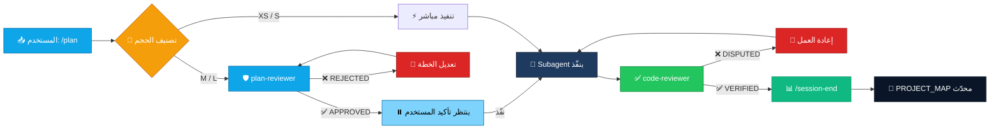
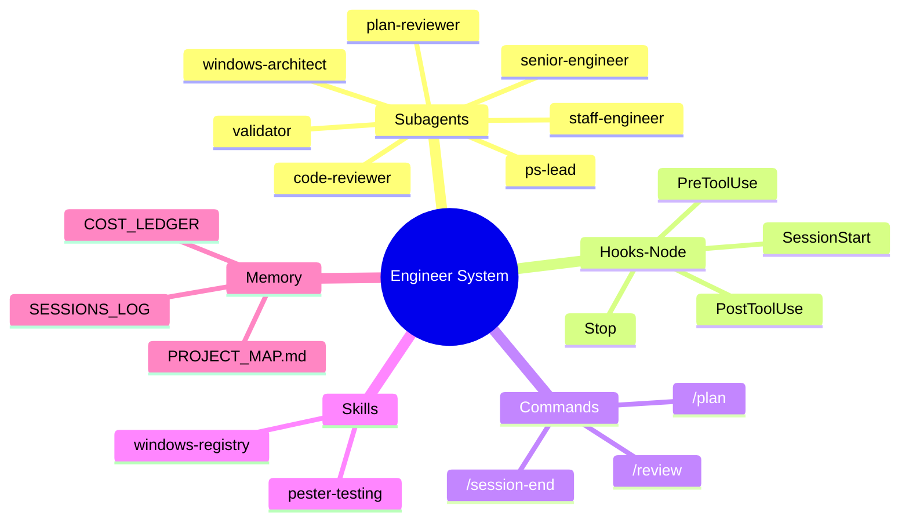
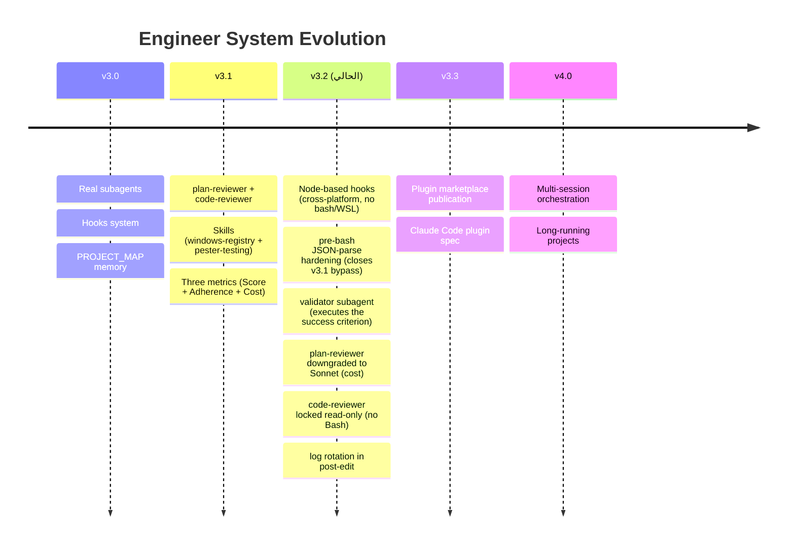

<div align="center">


[](#)
[](#-subagents--الوكلاء-المتخصصون)
[](#)
[](#-hooks--الـ-hooks-البرمجية)
[](#)
[](https://marketplace.visualstudio.com/items?itemName=anthropic.claude-code)
[](https://github.com/F2lcon01)


</div>

---

## 📋 الفهرس

| # | القسم | الوصف |
|:-:|-------|-------|
| 1 | [🎯 لماذا هذا النظام](#-لماذا-هذا-النظام--why-this-exists) | الفجوة في قوالب Claude Code الحالية |
| 2 | [🏆 المزايا الأساسية](#-المزايا-الأساسية--core-features) | الـ subagents والـ hooks والـ skills |
| 3 | [🤖 الوكلاء المتخصصون](#-الوكلاء-المتخصصون--subagents) | جدول الـ 6 وكلاء وأدوارهم |
| 4 | [⚙️ الـ Hooks البرمجية](#%EF%B8%8F-الـ-hooks-البرمجية--hooks) | 4 أحداث تفرض القواعد آلياً |
| 5 | [🔄 Workflow بمرحلتين](#-workflow-بمرحلتين--two-gate-workflow) | مخطط `plan-reviewer` + `code-reviewer` |
| 6 | [🏗️ المعمارية](#%EF%B8%8F-المعمارية--architecture) | بنية النظام كاملةً |
| 7 | [📦 التثبيت](#-التثبيت--installation) | Windows / Linux / macOS |
| 8 | [▶️ الاستخدام](#%EF%B8%8F-الاستخدام--usage) | الجلسة الأولى + المقاييس الثلاثة |
| 9 | [📊 المقارنة](#-المقارنة-مع-القوالب-الأخرى--comparison) | مع `wshobson/agents`, `VoltAgent`, `CCDK` |
| 10 | [⚠️ الحدود والقيود](#%EF%B8%8F-الحدود-والقيود--limitations) | ما لا يقدر النظام عليه |
| 11 | [🗺️ خارطة الطريق](#%EF%B8%8F-خارطة-الطريق--roadmap) | v3.2 → v4.0 |
| 12 | [📈 الإحصائيات](#-إحصائيات-المشروع--project-stats) | عدّ الملفات والأسطر |

---

## ⚡ الـ Flow الذكي (v3.3) — One Command → Smart Project

```text
1. cd C:\projects\my-new-project
2. install-eng                    ← ينسخ النظام (10 ثوانٍ)
3. claude (في VS Code)
4. /bootstrap                     ← يقرأ المشروع + يمسح GitHub + يملأ الذاكرة
5. /plan <مهمتك>                  ← يبدأ العمل بمعرفة كاملة عن المشروع
```

**النتيجة:** كلود يعرف من اللحظة الأولى: ما هو مشروعك، ما تقنياته، أين الـ entry points، ما هي المشاريع المشابهة على GitHub، وأي أمر يُشغّل اختباراتك.

---

## 🎯 لماذا هذا النظام — Why This Exists

> معظم قوالب Claude Code إما **كتالوج بـ 100+ وكيل لن تستخدم منهم 5%**، أو **بروم�� ضخم في `CLAUDE.md` ينساه الموديل في منتصف الجلسة**. هذا النظام مختلف.

| الجانب | الطريقة التقليدية | Engineer System |
|--------|-------------------|:---------------:|
| **عدد الوكلاء** | 🔴 100+ يفقد التركيز | 🟢 **7 فقط** — كل واحد له دور قاطع |
| **الـ Memory** | 🔴 يضيع بين الجلسات | 🟢 **PROJECT_MAP.md** يُحقَن آلياً |
| **مراجعة الخطة** | 🔴 لا توجد | 🟢 **plan-reviewer قبل التنفيذ** |
| **مراجعة الكود** | 🔴 مدمجة مع المنفّذ | 🟢 **code-reviewer مستقل** + **validator** ينفّذ المعيار فعلاً |
| **منصة Windows** | 🔴 درجة ثانية | 🟢 **First-class** — Registry + GPO + PS |
| **تتبع التكلفة** | 🔴 لا توجد آلية | 🟢 **`$/point` ledger** (تقريبي — راجع القيود) |
| **القواعد** | 🔴 برومبت يطلب | 🟢 **Node hooks تفرض برمجياً** (cross-platform، لا bash) |

> [!IMPORTANT]
> **النطاق المقصود:** Windows فقط، عبر **Claude Code for VS Code** extension. الـ hooks مكتوبة بـ Node لتجنّب اعتماد bash/WSL (الذي يكسر Claude Code على Windows عند وجود WSL). `windows-architect` و `ps-lead` يحتفظان بعمق Windows-internals (Registry, GPO, PowerShell modules, Pester).

---

## 🏆 المزايا الأساسية — Core Features

<div align="center">

### 1️⃣ Real Subagents — وكلاء حقيقيون بسياقات منفصلة

</div>

> كل وكيل ملف `.md` بـ YAML frontmatter، يعمل في **context window منفصل**، ويختاره Claude Code تلقائياً حسب وصف المهمة.

```
  ┌──────────────────────────────────────────────────────────┐
  │  🥇  staff-engineer     →  بحث + تحليل + مقارنة         │
  │  🥈  senior-engineer    →  تنفيذ كود إنتاجي عام         │
  │  🥉  windows-architect  →  Registry + GPO + Deployment   │
  │  🔧  ps-lead            →  PowerShell modules + Pester   │
  │  🛡️  plan-reviewer      →  بوابة قبل التنفيذ (sonnet)   │
  │  ✅  code-reviewer      →  بوابة بعد التنفيذ            │
  │  🧪  validator          →  ينفّذ معيار النجاح فعلياً     │
  └──────────────────────────────────────────────────────────┘
```

> [!TIP]
> الفرق عن قوالب الـ "100+ agents": هنا كل وكيل **يُستدعى فعلاً** في مشروع حقيقي، لا مجرد ملف مزخرف.

<div align="center">

### 2️⃣ Hooks That Enforce — لا تطلب (Node-based في v3.2)

</div>

> الـ hooks تشتغل **خارج LLM** — لا يمكن للموديل تجاوزها بـ "نسيت" أو "حاولت تعديل القاعدة". مكتوبة بـ Node لتعمل cross-platform دون bash/WSL.

```
  📡  PreToolUse (Bash)    ──→  JSON-parse صارم + 20+ pattern مدمّر (rm -rf، mkfs، dd، fork bomb، git push -f، DROP DATABASE، curl|sh ...)
  📊  PostToolUse (Edit)   ──→  يسجل كل تعديل + يدوّر اللوج عند 256KB
  🚀  SessionStart         ──→  يحقن PROJECT_MAP + git context تلقائياً (stdout = context)
  ⏱️  Stop                 ──→  يذكّر بـ /session-end لو عُدّلت ملفات بلا تحديث الذاكرة
```

> [!IMPORTANT]
> **التحديث الحرج في v3.2:** الـ hooks انتقلت من bash إلى Node.js. هذا يحلّ ثغرة `grep`-based JSON parsing في v3.1 ومشاكل WSL/Git Bash على Windows. المتطلب الوحيد: **Node 18+** (موجود مع Claude Code أصلاً).

<div align="center">

### 3️⃣ Progressive-Disclosure Skills — معرفة عند الحاجة

</div>

> Skills تُحمَّل **فقط عند الحاجة** — توفير توكن حقيقي مقابل وضع كل المعرفة في وكيل واحد ضخم.

```
  📡  Skills Library
      ├── windows-registry  →  Patterns آمنة لتعديل Registry مع rollback
      └── pester-testing    →  Pester 5+ patterns للاختبارات الإنتاجية
```

---

## 🤖 الوكلاء المتخصصون — Subagents

<details open>
<summary><h3>🖥️ الجدول الكامل — 7 وكلاء</h3></summary>

| # | Subagent | Role | Model | Trigger |
|:-:|----------|------|:-----:|---------|
| 1 |  | بحث، تحليل، مقارنة | `Sonnet` | research, compare, investigate |
| 2 |  | تنفيذ، bug fix، refactor | `Sonnet` | implement, write code, fix bug |
| 3 |  | Registry، GPO، Deployment | `Opus` | registry, GPO, telemetry, harden |
| 4 |  | PowerShell modules، Pester | `Sonnet` | PowerShell, .psm1, Pester |
| 5 |  | يراجع الخطط قبل التنفيذ | `Sonnet` | review plan, validate approach |
| 6 |  | يتحقق من العقود بعد التنفيذ | `Sonnet` | review code, verify contract |
| 7 |  | ينفّذ معيار النجاح فعلياً (tests/lint/build) | `Haiku` | validate criterion, run tests, prove it passes |

> [!NOTE]
> فقط **`windows-architect` على Opus** — لأن قرارات Registry/GPO الخاطئة تكسر الأنظمة. باقي الوكلاء على Sonnet للتوازن، و **`validator` على Haiku** لأن دوره ميكانيكي (ينفّذ ويُبلّغ، لا يحلّل).
> **تغيير v3.2:** `plan-reviewer` نُقل من Opus إلى Sonnet — التقييم العملي أثبت أن Sonnet كافٍ لمراجعة الخطط، والتوفير في التكلفة جوهري.

</details>

---

## ⚙️ الـ Hooks البرمجية — Hooks

| Hook | Event | الغرض | الكود |
|------|-------|-------|:-----:|
| `session-start.mjs` | `SessionStart` | حقن `PROJECT_MAP.md` + git context عبر stdout | Node 18+ |
| `pre-bash.mjs` | `PreToolUse:Bash` | JSON-parse + حظر 20+ نمط مدمّر | Node 18+ |
| `post-edit.mjs` | `PostToolUse:Edit\|Write\|MultiEdit` | تسجيل + rotation عند 256KB | Node 18+ |
| `stop-reminder.mjs` | `Stop` | تذكير ذكي بـ `/session-end` (يحسب unique files) | Node 18+ |

> [!CAUTION]
> الأنماط المحظورة في `pre-bash.mjs` تشمل: `rm -rf /` و `rm --no-preserve-root`، `mkfs.*`، `dd of=/dev/*`، `chmod/chown -R … /`، fork bombs، `shutdown/reboot now`، `git push -f` (و `--force-with-lease`)، `git reset --hard HEAD~`، حذف فرع محمي، `DROP DATABASE/TABLE`، `TRUNCATE`، `docker system prune -a`، `kubectl delete ns/all`، و `curl|wget … | bash`. **JSON-parsed لا regex على نص خام** — تجاوز v3.1 (escaping بسيط) أُغلق.

---

## 🔄 Workflow بمرحلتين — Two-Gate Workflow



> [!TIP]
> **القاعدة الذهبية:** لا تتجاوز بوابة. المهام XS فقط هي التي تُنفَّذ مباشرة بدون مراجعة.

### مثال جلسة (توضيحي — ليس قياساً فعلياً)

```text
المستخدم: /plan add Cortana disable feature

Principal Engineer:
  → يحلل، يصنّف M، يقترح windows-architect
  → يستدعي plan-reviewer تلقائياً
     plan-reviewer: "rollback plan missing for HKLM:\...\Cortana"
  → Principal: أصلح الخطة، أضف rollback
  → plan-reviewer: ✅ APPROVED
  → ⏸️ ينتظر تأكيد المستخدم

المستخدم: نفّذ
  → windows-architect ينفّذ
  → code-reviewer يفحص العقود (pre/post conditions)
  → validator ينفّذ Pester فعلياً → exit 0 + transcript
  → ✅ VERIFIED + ✅ PASS

Principal: يقبل → /session-end
  📊 يُحدِّث Score + Adherence + Cost في COST_LEDGER
  (الأرقام الفعلية تأتي من جلستك أنت — لا أكتب أرقاماً وهمية)
```

---

## 🏗️ المعمارية — Architecture



### بنية الملفات بعد التثبيت

```
  your-project/
  ├── 📜 CLAUDE.md                       ← Orchestration layer
  ├── 📁 memory/
  │   └── 🧠 PROJECT_MAP.md              ← ذاكرة دائمة (auto-injected)
  └── 📁 .claude/
      ├── ⚙️  settings.json              ← Hooks configuration
      ├── 📁 agents/                     ← 7 subagents (.md + YAML)
      ├── 📁 commands/                   ← 3 slash commands
      ├── 📁 hooks/                      ← 4 Node ESM hooks (.mjs)
      └── 📁 skills/                     ← 2 progressive skills
```

---

## 📦 التثبيت — Installation (Windows فقط)

طريقتان متاحتان. يُوصى بالأولى للوكلاء/Hooks/Skills، والثانية لـ project-scoped files (`CLAUDE.md`, `PROJECT_MAP.md`).

### ▶️ الطريقة 1 (v3.4-alpha): Claude Code Plugin

```text
# داخل Claude Code (VS Code):
/plugin marketplace add F2lcon01/Engineer-System
/plugin install engineer-system@engineer-system-marketplace
```

ينصّب الـ 7 وكلاء + 6 skills + 6 commands + 4 hooks تلقائياً وعالمياً (لكل مشاريعك).
ملاحظة: الـ commands تصبح `/engineer-system:plan`, `/engineer-system:bootstrap`، إلخ (plugin namespace).

### ▶️ الطريقة 2: PowerShell Installer (الـ canonical الحالي)

```powershell
# 1. استنسخ المستودع لمكانه الافتراضي
git clone https://github.com/F2lcon01/Engineer-System.git "$env:USERPROFILE\Desktop\Engineer System"

# 2. سجّل اختصار install-eng في الـ profile (مرة واحدة)
$func = 'function install-eng { & "$env:USERPROFILE\Desktop\Engineer System\installer\Install-EngineerSystem.ps1" @args }'
Add-Content -Path $PROFILE -Value $func -Force
. $PROFILE

# 3. ثبّت في أي مشروع
cd C:\path\to\your-project
install-eng
```

يضع كل شيء داخل مشروعك في `.claude/` + ينشئ `CLAUDE.md` + `CLAUDE.local.md` + `memory/PROJECT_MAP.md`.

### أيها أختار؟

| | Plugin (v3.4-alpha) | Installer (canonical) |
|--|--|--|
| الـ agents/skills/commands/hooks | عالمياً (كل المشاريع) | محلياً (لكل مشروع) |
| `CLAUDE.md` و `PROJECT_MAP.md` | ❌ (لا ينقلها plugin) | ✅ |
| تحديث | `/plugin update` | `install-eng -Mode Upgrade` أو `/update` |
| namespace في الـ commands | `/engineer-system:plan` | `/plan` |

**نصيحتي:** ابدأ بـ Installer (canonical) لاختبار النظام. لو أعجبك، أضف plugin install بجانبه للحصول على عالمية الـ shared components.

### ▶️ أوضاع المثبّت

| الوضع | الأمر | الغرض |
|-------|------|-------|
| 🟢 **Install** | `install-eng` | تثبيت جديد (يفشل إذا وُجد) |
| 🔄 **Upgrade** | `install-eng -Mode Upgrade` | تحديث الوكلاء مع حماية بياناتك |
| 🔍 **DryRun** | `install-eng -Mode DryRun` | معاينة بدون كتابة |
| ⚠️ **Force** | `install-eng -Force` | استبدال بالقوة (خطر) |

### ✅ التحقق من التثبيت

```powershell
Test-Path .\CLAUDE.md
Test-Path .\.claude\settings.json
Test-Path .\memory\PROJECT_MAP.md
Get-ChildItem .\.claude\agents
```

> [!NOTE]
> يجب أن تظهر `CLAUDE.md` و `.claude/settings.json` و `memory/PROJECT_MAP.md` و **7 ملفات وكلاء** داخل `.claude\agents`.

---

## 🆚 الاستخدام داخل VS Code — Claude Code Extension

### الإعداد

1. ثبّت **Claude Code for VS Code** من Marketplace (Anthropic publisher)
2. افتح مجلد المشروع في VS Code: `code C:\projects\my-project`
3. شغّل التثبيت: في الـ Terminal المدمج اكتب `install-eng`
4. أعد تحميل النافذة: `Ctrl+Shift+P` → `Developer: Reload Window`
5. افتح لوحة Claude (الأيقونة الجانبية أو `Ctrl+Esc`)

### ما الذي يصبح أذكى تلقائياً داخل VS Code؟

| الميزة | الأثر |
|--------|------|
| **`ide_selection` تلقائي** | ما تحدّده بالماوس يصل للوكيل بلا نسخ |
| **Links قابلة للنقر** | `[file.ts:42](src/file.ts#L42)` يفتح الملف على السطر |
| **Diagnostics مدمجة** | الـ post-edit hook يلتقط lint/type errors فوراً |
| **Status bar** | حالة الـ subagent ومستوى التكلفة مرئية |
| **Editor context** | الملف المفتوح يصل ضمن السياق دون أن تطلبه |

### نمط العمل اليومي داخل VS Code

```
1. حدّد كتلة كود بالماوس
2. افتح Claude (Ctrl+Esc)
3. اكتب: /plan أصلح الـ bug في هذا الكود
4. الـ Principal يرى الكود المحدّد + المشروع كاملاً
5. يستدعي plan-reviewer → senior-engineer → code-reviewer → validator
6. تنتهي المهمة، اكتب /session-end
```

> [!TIP]
> اربط `Ctrl+Esc` بفتح Claude لو غير مفعّل افتراضياً. وفعّل **"Show Claude Status in Status Bar"** في إعدادات الـ extension.

---

## ▶️ الاستخدام — Usage

### الجلسة الأولى

```powershell
cd C:\path\to\your-project
install-eng                    # مرة واحدة
claude                         # افتح Claude Code
```

داخل Claude Code اكتب:

```
/plan Add a PowerShell function to check Windows Update service status
```

> النظام يحلّل، يقترح `ps-lead`، يضع معيار نجاح قابلاً للاختبار، ويستدعي `plan-reviewer` للمهام M/L تلقائياً. أكّد للمتابعة.

### المقاييس الثلاثة في `/session-end`

```
  ┌──────────────────────┬──────────────────────────────────────┐
  │  📊 Score /50        │  جودة المخرج الكلية                  │
  │  🎯 Plan-Adherence   │  /10 — مدى الالتزام بالخطة الأصلية   │
  │  💰 Cost-of-Pass     │  التكلفة الفعلية بالتوكن/الدولار     │
  └──────────────────────┴──────────────────────────────────────┘
```

### COST_LEDGER — شكل البيانات

```text
| Session | Date       | Score | Adherence | Tokens | Cost $ | $/point |
|---------|------------|-------|-----------|--------|--------|---------|
| N       | YYYY-MM-DD | X/50  | X/10      | ~T     | ~$X    | $X      |
```

> [!IMPORTANT]
> الأرقام تأتي من جلساتك الفعلية — لا توجد أرقام افتراضية مسبقة. بعد 10–15 جلسة، الـ `[COST_LEDGER]` يكشف **نمطك الشخصي**: متى تنحرف، ومتى تنجح، وأي workflows تستحق فعلاً.

> [!WARNING]
> Claude Code لا يكشف عدد التوكن بدقة لحظية حالياً. استخدم `/cost` slash command الرسمي للحصول على الرقم الأقرب، وعامِل `$/point` كمؤشر اتجاه لا قياس مطلق.

---

## 📊 المقارنة مع القوالب الأخرى — Comparison

| الميزة | **Engineer System** | wshobson/agents | VoltAgent | peterkrueck/CCDK |
|--------|:-------------------:|:---------------:|:---------:|:----------------:|
| Real subagents (YAML) | ✅ **7 focused** | ✅ ~185 | ✅ ~131 | ✅ |
| Programmatic hooks | ✅ **4 Node hooks** | 🟡 جزئي | ❌ | 🟡 جزئي |
| Cross-platform hooks (no bash) | ✅ **Node ESM** | ❌ | ❌ | ❌ |
| Persistent memory | ✅ **Auto-injected** | ❌ | ❌ | 🟡 جزئي |
| Three-gate review | ✅ **Plan + Code + Validator** | ❌ | ❌ | جزئي (parallel) |
| Windows/PowerShell | ✅ **First-class** | ❌ | ❌ | ❌ |
| Cost tracking | ✅ **`$/point`** (تقريبي) | ❌ | ❌ | ❌ |
| Installer | ✅ **PowerShell** (Windows-only) | ❌ | ❌ | Bash فقط |
| File count | 📦 **~28** | 500+ | 100+ | 50+ |

> [!TIP]
> النظام **مقصود أن يكون أصغر** من المنافسين. ليس كتالوجاً — بل إطار عمل ذو رأي واضح.

---

## ⚠️ الحدود والقيود — Limitations

> [!WARNING]
> الصدق المعتاد حول ما لا يقدر النظام عليه:

| القيد | الشرح |
|-------|-------|
| 🟠 **ليس للجلسات القصيرة** | تكلفة بدء الـ subagents ~3-4K توكن لكل وكيل. مفيد لجلسات +2 ساعة، مهدر لـ Q&A سريع. |
| 🟠 **plan-reviewer قد يرفض خطط بسيطة** | تجاوز عند المبرر، وعدّل البرومبت إذا تكرر. |
| 🟠 **تتبع التكلفة تقريبي** | Claude Code لا يكشف عدد التوكن بدقة لحظية. استخدم `/cost` ثم سجّل في `[COST_LEDGER]`. |
| 🟠 **Claude Code فقط** | الـ hooks والـ subagents لا توجد في `claude.ai`. النظام بلا قيمة هناك. |
| 🟠 **Plan-adherence ذاتي** | تقيّمه أنت. كن صادقاً ولا تعطِ نفسك 10/10 إذا انحرفت. |
| 🟠 **`validator` يتطلب معياراً قابلاً للتنفيذ** | إذا الـ success criterion مكتوب كنص فلسفي بلا أمر يثبته، الـ validator سيرفض. اكتب criterions تنفيذية (Pester/npm/pytest). |
| 🟠 **Skills `.md` تُحمَّل عند قراءتها** | لا يوجد auto-load في Claude Code الحالي — الوكيل يجب أن يقرأها صراحة. وعد "progressive disclosure" يتطلب تفاعل الوكيل. |

---

## 🗺️ خارطة الطريق — Roadmap



---

## 📈 إحصائيات المشروع — Project Stats

<div align="center">

| Category | Count | Notes |
|----------|:-----:|:------|
| 🤖 Subagents | **7** | +validator في v3.2 |
| ⚙️ Hooks | **4** | Node ESM (.mjs) — cross-platform |
| 💬 Slash Commands | **3** | /plan, /review, /session-end |
| 🧠 Skills | **2** | windows-registry, pester-testing |
| 📜 Installer | **1** | Install-EngineerSystem.ps1 (Windows-only) |

</div>

---

## 🔧 المتطلبات — Requirements

```
  📡 Required Stack (Windows 10/11)
      ├── Windows 10/11           →  الـ OS الوحيد المُختبَر
      ├── VS Code                 →  أحدث إصدار
      ├── Claude Code Extension   →  من Marketplace (Anthropic)
      ├── Node.js                 →  v18+  (إلزامي للـ hooks)
      └── PowerShell              →  5.1+  (موجود افتراضياً مع Windows)
```

> [!IMPORTANT]
> **v3.2 لا تحتاج Git Bash/WSL.** الـ hooks Node-based، فالاعتماد الوحيد هو Node 18+ الذي يأتي مع Claude Code عادةً.

---

## 🚀 إصدار نسخة جديدة — Releasing (للمساهمين)

عند الإفراج عن `vX.Y.Z` جديدة:

### 1. حدّث ملفات الإصدار

- `README.md` → badge Version
- `CHANGELOG.md` → قسم جديد على رأس الملف (Keep-a-Changelog format)
- `CLAUDE.md` → عنوان `# Principal Engineer — vX.Y.Z`

### 2. Commit + tag + push

```powershell
git add -A
git commit -m "Release vX.Y.Z: <one-line summary>"
git tag -a vX.Y.Z -m "Engineer System vX.Y.Z — <theme>"
git push origin main
git push origin vX.Y.Z
```

### 3. أنشئ GitHub Release (يربط الـ tag بصفحة Releases الرسمية)

**خيار A — عبر `gh` CLI (موصى به):**

```powershell
gh release create vX.Y.Z --notes-from-tag --title "vX.Y.Z — <theme>"
```

**خيار B — عبر الواجهة:**

1. اذهب لـ `https://github.com/F2lcon01/Engineer-System/releases/new`
2. اختر الـ tag الجديد
3. الصق ملخص `CHANGELOG.md` للنسخة
4. Publish

### 4. اختبار سريع بعد الإطلاق

```powershell
cd C:\temp
git clone https://github.com/F2lcon01/Engineer-System.git test-release
cd test-release
node .claude/hooks/__smoke-test.mjs   # يجب أن يعطي 10/10
```

---

## 🤝 المساهمة — Contributing

Pull requests مرحَّب بها. قبل فتح PR:

1. ✅ اختبر تغييرك في مشروع حقيقي لجلسة كاملة على الأقل
2. ✅ حدّث `README.md` إذا غيّرت سلوكاً يراه المستخدم
3. ✅ تأكد أن الـ hooks تعمل على Git Bash على Windows
4. ✅ أضف معيار نجاح قابلاً للاختبار في الـ PR description

---

## 📜 الترخيص — License


MIT License — راجع ملف [LICENSE](LICENSE).

---

<div align="center">

**Engineer System v3.3** — بقلم Falcon (fox01vip@gmail.com)

[](https://github.com/F2lcon01)
[](https://github.com/F2lcon01/Engineer-System)
[](https://github.com/F2lcon01)


</div>
